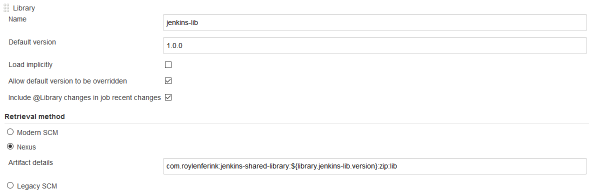

# Nexus Shared Libraries Retriever plugin

[](https://plugins.jenkins.io/pipeline-global-lib-nexus)
[](https://github.com/jenkinsci/pipeline-global-lib-nexus-plugin/releases/latest)
[](https://plugins.jenkins.io/pipeline-global-lib-nexus)

The current official [pipeline-groovy-lib-plugin](https://github.com/jenkinsci/pipeline-groovy-lib-plugin/) does provide a way to retrieve 
shared libraries through a SCM, such as Git. The goal of this plugin is to provide another way to retrieve shared libraries via the @Library 
declaration in a Jenkinsfile.

## Context

The Nexus shared library retriever is implemented to retrieve [shared libraries](https://jenkins.io/doc/book/pipeline/shared-libraries/) from Nexus.

## Installation of the plugin

### Installing from source

You can follow the steps hereafter to install the plugin:

* Clone the sources of this repository
* Run `mvn package` in order to compile the sources and package them in a .hpi file
* Follow the [instructions that can be found on the Jenkins website](https://jenkins.io/doc/book/managing/plugins/#installing-a-plugin) and install the plugin 
that has been packaged in `target/pipeline-global-lib-nexus.hpi`

### Installing from artifact

#### Installing from the Plugins site

The plugin is referenced as an official plugin in the Jenkins update site, so you should be able to use the integrated search in the Plugin section.

#### To install the plugin manually

You can find the archives of all the version of the Plugin on the [Update site](https://plugins.jenkins.io/pipeline-global-lib-nexus).
You can also Download the wished plugin release from the GitHub releases section.
The, go to the Jenkins Administration Plugins UI > Advanced section and upload the plugin .hpi file.

## How to use the plugin

### Pre-requisite: package the library

In order to be able to use this plugin, you need to package your library (probably during a Continuous Integration build) and publish it to Nexus
so Maven can be used to download the artifact again. You should end up with a ZIP file with the following structure:

```bash
> unzip -vl pipeline-libraries.zip
Archive:  pipeline-libraries.zip
 Length   Method    Size  Cmpr    Date    Time   CRC-32   Name
--------  ------  ------- ---- ---------- ----- --------  ----
     xxx  Defl:N      xxx  37% 03-21-2019 12:14 7d354e1f  resources/a-rsc-needed
    xxxx  Defl:N     xxxx  68% 03-21-2019 12:14 fefba77f  src/your/package/YourGroovyClass.groovy
     xxx  Defl:N      xxx  33% 03-21-2019 12:14 5b6808ab  vars/yourvar.groovy
     xxx  Defl:N      xxx  39% 03-21-2019 12:14 5842cc52  vars/yourvar.txt
--------          -------  ---                            -------
  xxxxxx           xxxxxx  x%                            n files
```

If you want to package it like this with maven, you can use the following.
In your pom.xml

```xml
<build>
   <plugins>
      <plugin>
            <artifactId>maven-assembly-plugin</artifactId>
            <version>2.6</version>
            <executions>
               <execution>
                  <configuration>
                        <finalName>your-library</finalName>
                        <descriptors>
                           <descriptor>assembly.xml</descriptor>
                        </descriptors>
                  </configuration>
                  <id>make-assembly1</id>
                  <phase>package</phase>
                  <goals>
                        <goal>single</goal>
                  </goals>
               </execution>
            </executions>
      </plugin>
   </plugins>
</build>
```

The assembly.xml file:

```xml
<assembly xmlns="http://maven.apache.org/plugins/maven-assembly-plugin/assembly/1.1.3"
  xmlns:xsi="http://www.w3.org/2001/XMLSchema-instance"
  xsi:schemaLocation="http://maven.apache.org/plugins/maven-assembly-plugin/assembly/1.1.3 http://maven.apache.org/xsd/assembly-1.1.3.xsd">
  <id>lib</id>

  <formats>
    <format>zip</format>
  </formats>

  <includeBaseDirectory>false</includeBaseDirectory>

  <fileSets>
    <fileSet>
      <directory>.</directory>
      <outputDirectory>/</outputDirectory>
      <lineEnding>unix</lineEnding>
      <includes>
        <include>src/**</include>
        <include>vars/**</include>
        <include>resources/templates/*.json</include>
        <include>resources/*.sh</include>
        <include>version.txt</include>
      </includes>
    </fileSet>
  </fileSets>

</assembly>
```

### Constraints

*The plugin only supports ZIP shared libraries for the moment.*

### Setup of the plugin

The plugin is configurable on the Jenkins UI, at different levels:

* On Global System Configuration page (Administration)
* On Folder Configuration page
* On Pipeline Configuration page

Jenkins administrators can set [global libraries on the Administration page](https://jenkins.io/doc/book/pipeline/shared-libraries/#global-shared-libraries), 
while Jenkins users can set libraries either on the [Folder view](https://jenkins.io/doc/book/pipeline/shared-libraries/#folder-level-shared-libraries) or on 
the Pipeline view.

The generic documentation to reference a new shared library can be found [here](https://jenkins.io/doc/book/pipeline/shared-libraries/#using-libraries).

### In the Jenkins UI

In Administration / Folder / Pipeline configuration views:

* Go to the Global Pipeline Libraries section and add a new library. You should see 3 different retrieval methods: Modern SCM, Nexus and Legacy SCM.
* Give it a name and a default version
* Decide if you want to load it implicitly or not

* Provide the artifact details used to retrieve the shared libraries in the following format: `<groupId>:<artifactId>:<version>:<packaging>:<optional classifier>`. 
  In the example the following shared library is used: `com.roylenferink:jenkins-shared-library:${library.jenkins-lib.version}:zip:lib`.
* Provide a location to an available Maven installation. If `MAVEN_HOME` is not specified, the first-found
  Maven installation will be used. If Maven cannot be found the job will fail.
  In the example the following Maven location is used `/tools/apache-maven-3.6.2`.

The artifact details are version-dynamic, it follows the Jenkins standard annotation `${library.<library_name>.version}` that is afterwards replaced either by the 
default version provided by the admin, or the version specified by the user Jenkinsfile in the @Library annotation.

### Directly in the Jenkinsfile

Users can also retrieve shared libraries from their Jenkinsfile, by defining it with this syntax:

```groovy
library identifier: 'external-shared-libraries@4.1.0', retriever: nexus(
   artifactDetails: 'com.roylenferink:jenkins-shared-library:${library.external-shared-libraries.version}:zip:lib',
   mavenHome: '/tools/apache-maven-3.6.2')
```

## Contributing

You can contribute to this plugin by retrieving the source and following the [official Jenkins plugin tutorial](https://wiki.jenkins.io/display/JENKINS/Plugin+tutorial) 
to install, run, test and package it.

## Release process

You're a maintainer of this repository and need to release a fix? Please follow the instructions below:

* Make sure you fulfilled the requirements that can be found [here](https://jenkins.io/doc/developer/publishing/releasing/)
* Be sure to be connected to no VPN to have SSH connection working
* Be sure to have no mirror defined in your global settings.xml (if needed pass --global-settings an-empty-settings.xml as an additional parameter)
* Place yourself on the master branch of [the jenkinsci fork](https://github.com/jenkinsci/pipeline-global-lib-nexus-plugin)
* ```mvn release:prepare``` and let the plugin increase the patch number (or increase yourself the minor or major)
* ```mvn release:perform```
* If things go wrong ```mvn release:clean```
* Update the [Wiki release notes](https://wiki.jenkins.io/display/JENKINS/Nexus+Shared+Libraries+Retriever+plugin)

## License

This project is licensed under the terms of the [MIT License](LICENSE).
